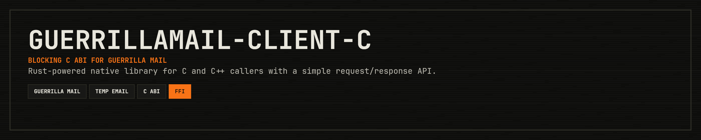

<p align="center">
  
</p>

<p align="center">
  <a href="https://crates.io/crates/guerrillamail-client-c"></a>
  <a href="#build"></a>
  <a href="https://en.wikipedia.org/wiki/Application_binary_interface"></a>
  <a href="https://opensource.org/licenses/MIT"></a>
</p>

<p align="center">
  <a href="#build">Build</a> · <a href="#regenerate-the-header">Header</a> · <a href="#usage-from-c-or-c">Usage</a> · <a href="#contributing">Contributing</a> · <a href="#support">Support</a> · <a href="#license">License</a>
</p>

---

C bindings for the Rust [`guerrillamail-client`](https://crates.io/crates/guerrillamail-client) crate.

This repo builds a native library with a blocking C ABI. Internally it owns a Tokio runtime and
uses the async Rust client underneath, so C and C++ callers can use a simple request/response API.

## Build

```bash
cargo build
```

Artifacts are written under `target/debug/`:

- `libguerrillamail_client_c.a`
- `libguerrillamail_client_c.dylib` on macOS
- `libguerrillamail_client_c.so` on Linux

The public header is [`include/guerrillamail_client.h`](include/guerrillamail_client.h).

## Regenerate the Header

The checked-in header matches the current ABI. If `cbindgen` is installed locally, regenerate it
with:

```bash
cbindgen --config cbindgen.toml --crate guerrillamail-client-c --output include/guerrillamail_client.h
```

## Usage from C or C++

See [`examples/demo.c`](examples/demo.c) for the full polling example that mirrors the Rust crate:
a random alias is created, the inbox is polled until a message arrives (or times out), the first
full message is fetched and printed, and the address is deleted during cleanup. The expected flow is:

1. Create a builder or default client.
2. Create a temporary email address.
3. Poll the inbox with `gm_client_get_messages()`.
4. Fetch the full message with `gm_client_fetch_email()`.
5. Free returned strings/lists/details explicitly.
6. On failure, inspect `gm_last_error_message()`.

To build the demo with CMake on macOS, Linux, or Windows:

```bash
cmake -S examples -B build/cmake-demo
cmake --build build/cmake-demo
```

For a release Rust library build, configure with
`-DGUERRILLAMAIL_CLIENT_C_PROFILE=Release`.

## Contributing

Contributions are welcome! Please feel free to submit a Pull Request.

1. Fork the repository
2. Create your feature branch (`git checkout -b feature/cool-feature`)
3. Commit your changes (`git commit -m 'Add some cool feature'`)
4. Push to the branch (`git push origin feature/cool-feature`)
5. Open a Pull Request

## Support

If this crate saves you time or helps your work, support is appreciated:

[](https://ko-fi.com/11philip22)

## License

This project is licensed under the MIT License; see the [license](https://opensource.org/licenses/MIT) for details.
